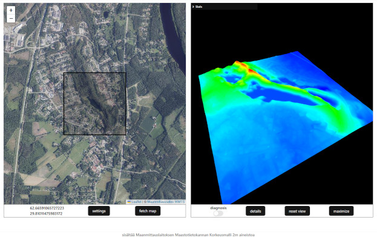

<h1 align="center"> Kartta3D - view Finnish elevation model's in 3D. (prototype)</h1>

  

---

<h3> Functionality: </h3>
<ul>
  <li>Select location from the Leaflet map and fetch</li>
  <li>.TIF is fetched from MaanMittausLaitos through k3d_back because of CORS</li>
  <li>.TIF is converted to pointcloud and colored according to elevation</li>
  <li>pointcloud is displayed with Three.js</li>
</ul>

---

<h4>Hosted on Render. (free)</h4>
<a href="https://kartta3d.onrender.com"> kartta3d.onrender.com </a>

Fetching the map(.TIF) will probably take a while since the backend is being hosted for free, the server has to spool up on fetch so the response time might be minutes..
